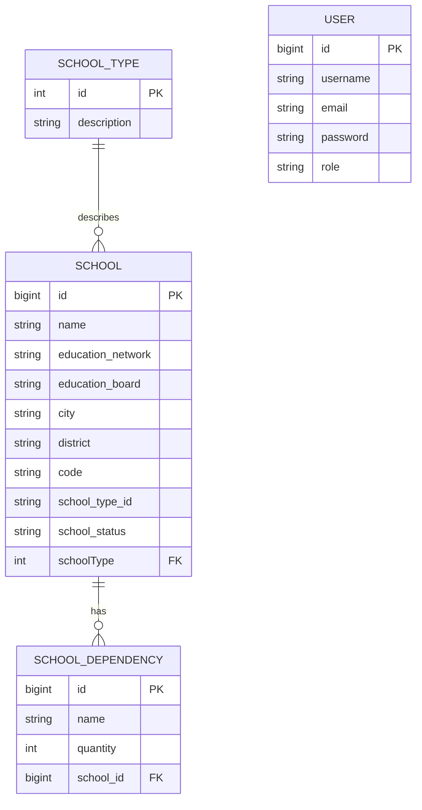
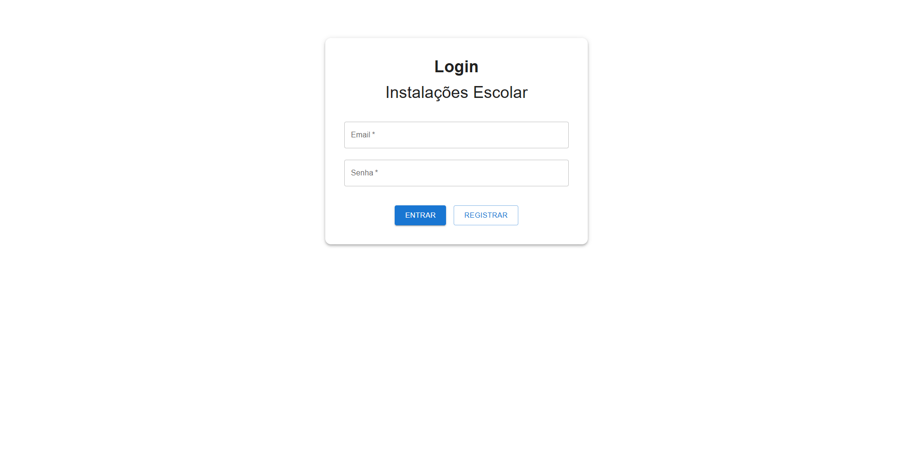
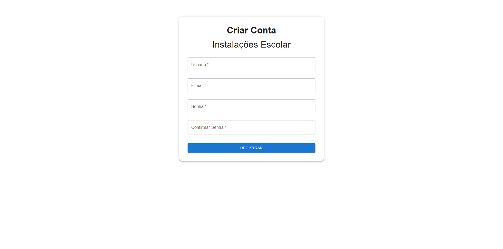
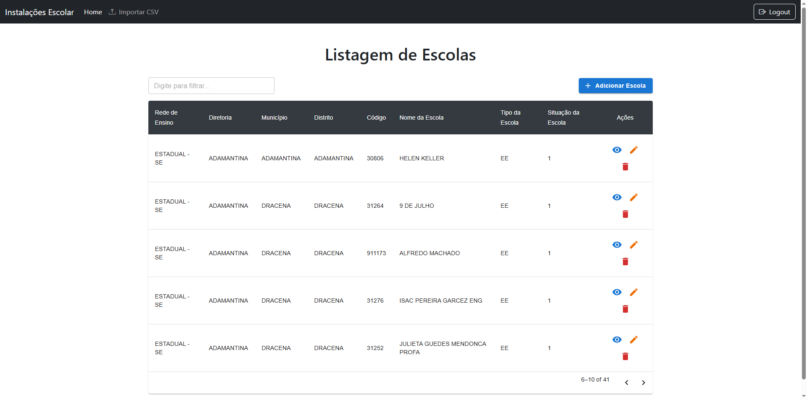
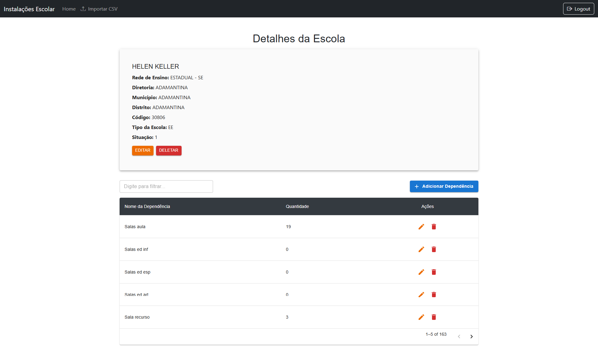
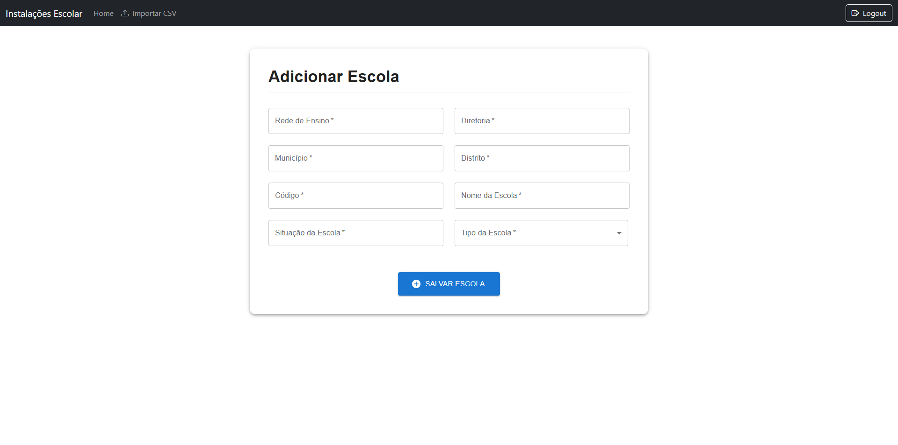
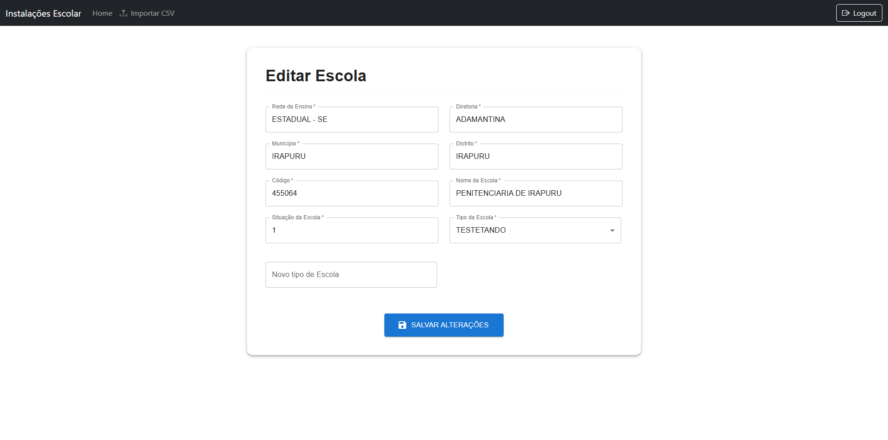
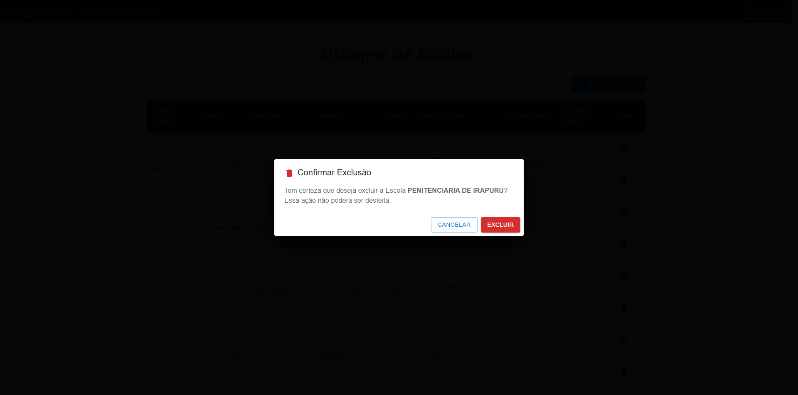
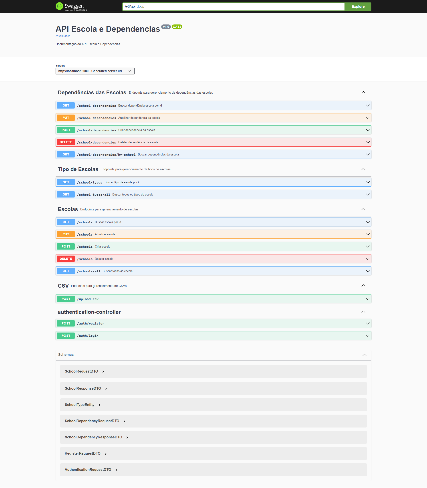

<div align="center">
  <h1> Teste Prático Fullstack - Instalações Escolares </h1>
</div>

<div align="center">
  <h3> Aplicação fullstack com upload de CSV e CRUD de dados escolares, usando Java com Spring Boot e React para o frontend. </h3>

  
  
  
  
  
</div>


Este projeto é composto por:

- **Backend**: Spring Boot (Java)
- **Frontend**: React.js (Vite)
- **Banco de Dados**: MySQL rodando em container Docker

---

## ✅ Funcionalidades do Sistema

- [x] Cadastro de usuários (registro e login)
- [x] Autenticação com JWT
- [x] Gerenciamento de escolas (criar, editar, visualizar, deletar)
- [x] Gerenciamento de dependências vinculadas às escolas (criar, editar, visualizar, deletar)
- [x] Importação de dados via upload de arquivos CSV

---

## 📦 Requisitos

Antes de iniciar, você precisa ter instalado:

- Node.js (v20.19.3)
- Java JDK 21
- Docker
- Maven ou, se preferir, pode usar uma IDE como o **IntelliJ IDEA (sugerido)**, que já trazem suporte ao Maven embutido e permitem rodar o projeto direto pela interface, sem precisar instalar o Maven globalmente.
---

## 📁 Repositório

Clone o repositório:
```bash
https://github.com/RenanMagalhaesLage/Teste-Pratico-Houer.git
```

---

## 🐳 Subindo o container do MySQL com Docker

Este projeto utiliza **Docker Compose** para subir facilmente o banco de dados MySQL necessário para o backend funcionar.

1. Abra o terminal e vá até a pasta raiz do backend:

```bash
cd backend/testePratico
```

2. Suba o container definido no **docker-compose.yml**:
```bash
docker compose up -d
```
3. Listar os containers em execução
```bash
docker ps 
```
4. Acessar o terminal do container (opcional)
```bash
docker exec -it container_mysql bash
```
5. Usar o cliente MySQL dentro do container (opcional)
```bash
mysql -u myuser -p
```
Digite a senha quando for solicitado (ela está configurada no docker-compose.yml)
A senha do usuário myuser: **secret**

---

## 🔧 Backend (Java / Spring Boot)

1. Abra o terminal e vá até a pasta raiz do backend:

```bash
cd backend/testePratico
```

2. Rode a aplicação

**(Sugerido)** Direto pela **IDE IntelliJ IDEA**

Ou, se preferiu pela instalação do Maven via terminal, o projeto pode ser rodado executando o comando

- Windows:
```bash
mvnw.cmd spring-boot:run
```

- Linux ou macOS
```bash
./mvnw spring-boot:run
```

---

## ⚛️ Frontend (React)

1. Abra o terminal e vá até a pasta raiz do backend

```bash
cd frontend/teste-pratico
```

2. Instale as dependências
```bash
npm install
```
3. Rode o projeto
```bash
npm run dev
```
4. O projeto será iniciado em modo de desenvolvimento. Por padrão, o frontend estará disponível em:

👉 http://localhost:5173

(Essa porta é a padrão usada pelo Vite. Caso esteja ocupada, uma porta alternativa será exibida no terminal.)

---

## 🖥️ Uso do sistema

1. Registre-se preenchendo seu nome, e-mail e senha para criar uma nova conta.
2. Faça login utilizando seu e-mail e senha cadastrados para acessar o sistema.
3. Para importar, clique na opção **Importar CSV** na barra de navegação.
Não é recomendado o uso de arquivos muito grandes, pois a operação pode demorar.
Neste repositório, há o [arquivo original das instalações físicas](https://dados.educacao.sp.gov.br/dataset/instala%C3%A7%C3%B5es-f%C3%ADsicas-por-unidade-escolar) com mais de 5 mil linhas e uma versão reduzida chamada "Escola_Dependencias_small.csv", com apenas 20 linhas, que pode ser usado para exemplificar a importação de maneira rápida.
4. Caso deseje adicionar escolas manualmente, clique no botão **Adicionar Escola** e preencha as informações obrigatórias para cadastrar novas unidades no sistema.
5. Para editar uma escola, clique no ícone de **lápis amarelo** diretamente na listagem ou clique no ícone de ícone olho azul para visualizar os detalhes da escola e, na página de visualização, clique em **Editar**.
6. Para deletar uma escola, clique no ícone de **lixeira vermelha** na listagem ou clique no ícone de **olho azul** para visualizar os detalhes da escola e, na página de visualização, clique em **Deletar**.
Confirme a ação na janela de confirmação para remover a unidade do sistema permanentemente.
7. Para gerenciar dependências de uma escola, acesse a página de visualização (ícone de olho azul).
Nela, é possível criar, editar e deletar dependências vinculadas à unidade escolar.
---

## 🧩 Diagrama Entidade Relacionamento do Banco de Dados



---

## 🖼️ Imagens do Projeto

Abaixo estão algumas capturas de tela que ilustram as principais funcionalidades do sistema:

### Tela de Login


### Tela de Registro


### Tela de Listagem de Escolas


### Tela de Visualização de Escola


### Tela de Cadastro de Escola


### Tela de Editar de Escola


### Modal de Deletar de Escola



---

## 📚 Documentação da API (Swagger)

A API do sistema é documentada utilizando o **Swagger**, que permite explorar os endpoints de forma interativa.
Disponível em: 
```bash
http://localhost:8080/swagger-ui/index.html
```


---
